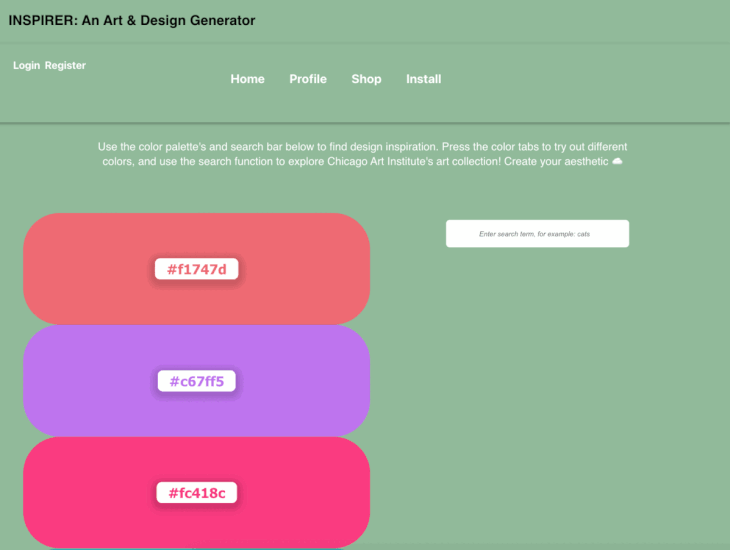

# ~~ INSPIRER APP ~~   

Sometimes the hardest step in an art/design project is coming up with ideas- an app like Inspirer can help any artist get the ball rolling!

Whenever we talk about inspiration, art & color can be and are often our muses. From the enormous scales of work in the sistine chapel to the minute details in the gaze of Mona Lisa, to the impromptu yet calculated works of Banksy or the curious splatters created by Jackson Pollock, art has inspired and caused many heads to wonder


We have developed a powerful interface that helps users quickly view art from the Chicago Institute of Art with random color palette's designed as a web application, built with interactive components that allows you to create your own profile of saved aesthetics


## User Story

```
AS A USER, 

I WANT to be able to register & log into an application
SO THAT I can view my profile & saved data 
I WANT to be able to see visual art when I type keywords of interest into the search bar 
SO THAT I can seek inspriation from artists 
I WANT to play with different color pairings
SO THAT I can visualize a design, mood and overall inspiration
I WANT to be able to save my desired colors & artworks
SO THAT I can come back to them 
I WANT to be able to easily explore the Chicago Institute's Shop 
SO THAT I can purchase artwork for my desired designs & projects
```

## Technology Utilized   

- React 
- Apollo
- MongoDB
- Material UI
- Chicago Art Institute API
- Color palette API 
- LoDash
- GraphQL, Node.js and Express.js 
- HTML, CSS, JavaScript
- Webpacks

## Installation

Install dependencies with npm i in various folders after git clone

```bash
  npm install @root folder
  npm install @server folder
  npm install @client folder 
```
    
## Usage

```javascript
  npm start or 
  npm run develop
```

## Authors

- [@Lisa Le](https://github.com/LisaTLe)
- [@Vanessa Roman](https://github.com/vanessaroman)
- [@Zoya Sarow](https://github.com/zoyasarow)
- [@Dosiano Torrez](https://github.com/DosTorrez)
- [@Can Sardaslar](https://github.com/sardaslar) 


## Deployed Application
---https

## License

[MIT](https://choosealicense.com/licenses/mit/)





